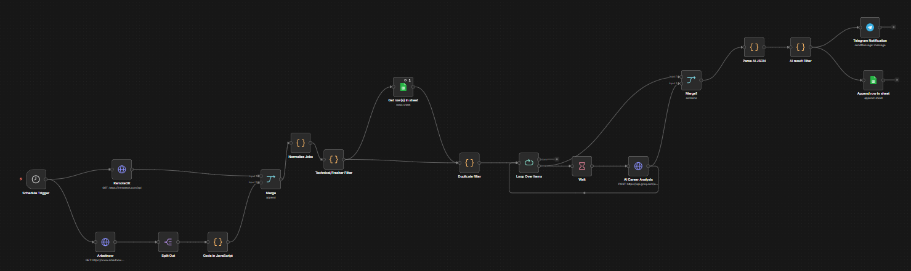
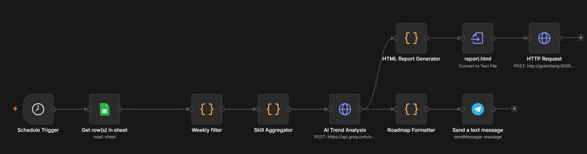
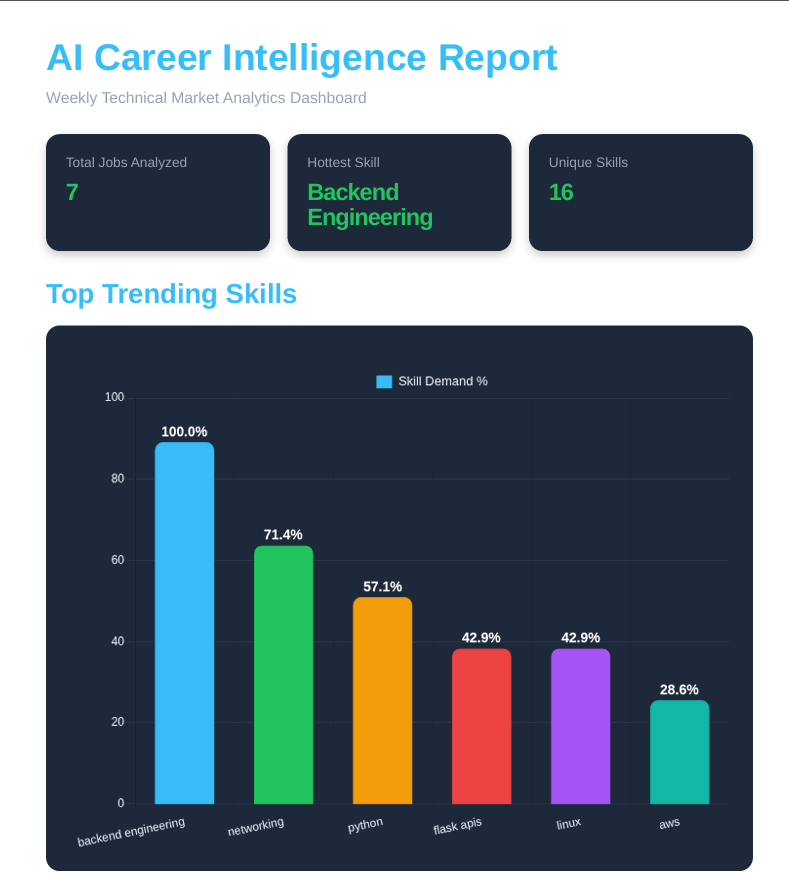

# AI Career Intelligence Platform

An autonomous AI-powered technical job market intelligence system built using n8n, Docker, Groq AI, Google Sheets, Telegram Bots, and PDF analytics reporting.

## Features

- Autonomous AI-powered job market analytics
- Daily technical job aggregation workflows
- Weekly AI-generated intelligence reports
- Dynamic PDF dashboard generation
- Chart.js analytics visualizations
- Telegram-based report delivery
- Automated workflow monitoring and error alerts
- Dockerized workflow orchestration using n8n

## Tech Stack

- n8n
- Docker
- Groq AI
- Telegram Bot API
- Google Sheets API
- Chart.js
- Gotenberg
- HTML/CSS
- JavaScript

## Workflow Architecture

### AI Job Hunter Workflow



---

### Weekly Skill Intelligence Workflow



---

## Analytics Dashboard Preview



## System Architecture

```text
Job Sources (RemoteOK + Arbeitnow)
            ↓
      n8n Automation
            ↓
     Skill Aggregation
            ↓
      AI Trend Analysis
            ↓
 PDF Dashboard Generation
            ↓
 Telegram Report Delivery
            ↓
 Error Monitoring Workflow
```

## Automation Workflows

### 1. AI Job Hunter
- Aggregates technical jobs daily
- Filters duplicate listings
- Uses AI for intelligent job insights
- Sends Telegram notifications automatically

### 2. Weekly Skill Intelligence
- Performs weekly skill trend analysis
- Generates PDF intelligence dashboards
- Visualizes market demand using Chart.js
- Delivers reports through Telegram

### 3. Error Monitoring
- Detects workflow failures automatically
- Sends real-time Telegram alerts
- Improves automation reliability


